# AI Search Intelligence Data Pipeline Optimization Plan

## Current State Analysis

### 🔍 **Data Flow Audit**

```mermaid
graph TD
    A[Search Request] --> B[Tavily API]
    B --> C[Content Fetching] 
    C --> D[Answer Generation]
    D --> E[Store in Redis]
    E --> F[Intelligence Report Request]
    F --> G[OpenAI Analysis]
    G --> H[Store Analysis]
    H --> I[Insights Dashboard]
    
    subgraph "Redis Storage"
        E --> E1[Bundle: sources, claims, evidence]
        H --> H1[Analysis: LLM response + metadata]
    end
    
    subgraph "Data Gaps"
        J[❌ Missing funnel metrics]
        K[❌ Source categories not sent to OpenAI]
        L[❌ Authority signals missing from OpenAI]
        M[❌ Subject context not passed to OpenAI]
    end
```


### 📊 **Current Performance Issues**

1. **Intelligence Report Quality**: 60% - Missing key data for OpenAI
2. **Data Completeness**: 75% - Funnel metrics missing from bundles
3. **Source Analysis**: 80% - Categories stored but not used by OpenAI
4. **Cross-Run Intelligence**: 40% - Limited aggregation capabilities

## Optimization Strategy

### 🎯 **Phase 1: Critical Data Fixes (Immediate - Week 1)**

#### 1.1 Fix OpenAI Intelligence Report Input
**Problem**: Source categories, credibility, subject not sent to OpenAI
**Impact**: Low-quality intelligence reports missing business context

**Solution**: Enhance `build_analysis_input()` in `analysis_llm.py`
```python
def to_source(s: Dict[str, Any]) -> Dict[str, Any]:
    # BEFORE: Limited data
    return {
        "source_id": s.get("source_id"),
        "url": s.get("url"),
        "domain": s.get("domain"),
        "title": s.get("title"),
        "published_at": s.get("published_at"),
        "media_type": s.get("media_type"),
        "text_snippet": text,
    }
    
    # AFTER: Rich business intelligence data
    return {
        "source_id": s.get("source_id"),
        "url": s.get("url"),
        "domain": s.get("domain"),
        "title": s.get("title"),
        "published_at": s.get("published_at"),
        "media_type": s.get("media_type"),
        "source_category": s.get("category"),           # ✅ Business categorization
        "credibility_score": s.get("credibility", {}).get("score"), # ✅ Authority signal
        "authority_level": classify_authority(s.get("credibility", {}).get("score", 0)), # ✅ High/med/low
        "recency_category": classify_recency(s.get("published_at")), # ✅ Recent/med/stale  
        "author": s.get("author"),                      # ✅ Authority signal
        "publisher": s.get("publisher"),                # ✅ Authority signal
        "word_count": s.get("word_count"),              # ✅ Content depth signal
        "paywall": s.get("paywall"),                    # ✅ Accessibility signal
        "text_snippet": text,
    }

# ALSO ADD: Subject context to input payload
input_payload = {
    "query": query,
    "subject": (bundle.get("run") or {}).get("subject"),  # ✅ Add subject context
    "search_model": (bundle.get("run") or {}).get("search_model"), # ✅ Add model context
    "sources": [to_source(s) for s in limited],
    # ... rest unchanged
}
```

#### 1.2 Add Missing Funnel Metrics
**Problem**: `optional_funnel` usually null - missing conversion analysis
**Impact**: Intelligence reports lack funnel optimization insights

**Solution**: Add computed analysis to all bundles in `store.py`
```python
def create_run(self, bundle: Dict[str, Any]) -> str:
    # ... existing code ...
    
    # Add source categorization (EXISTING)
    for source in sources:
        source["category"] = categorize_source(domain, media_type)
    
    # ✅ NEW: Add computed analysis with funnel metrics
    from ..services.analysis import compute_analysis
    analysis = compute_analysis(bundle)
    bundle["analysis"] = analysis  # Always include analysis
    
    # Store enhanced bundle
    CACHE.set_json(CACHE.ai_key(f"{run_id}"), bundle)
```

#### 1.3 Enhance Authority Classification
**Problem**: Authority signals exist but not classified for OpenAI
**Solution**: Add classification functions to `source_categorization.py`

```python
def classify_authority(credibility_score: float) -> str:
    """Classify source authority level for intelligence analysis."""
    if credibility_score >= 0.8: return "high"
    elif credibility_score >= 0.6: return "medium"
    else: return "low"

def classify_recency(published_at: str | None) -> str:
    """Classify content recency for intelligence analysis."""
    if not published_at:
        return "unknown"
    
    from datetime import datetime, timedelta
    try:
        pub_date = datetime.fromisoformat(published_at.replace('Z', '+00:00'))
        now = datetime.now(pub_date.tzinfo)
        age = now - pub_date
        
        if age <= timedelta(days=30): return "recent"
        elif age <= timedelta(days=180): return "medium" 
        else: return "stale"
    except:
        return "unknown"
```

### 🚀 **Phase 2: Performance Optimizations (Week 2)**

#### 2.1 Intelligent Source Selection for OpenAI
**Problem**: 12-source limit may miss important patterns
**Current**: All cited + top 5 non-cited
**Optimized**: Intelligent selection by category + authority

```python
def select_sources_for_analysis(sources: List[Dict], evidence: List[Dict], max_sources: int = 15) -> List[Dict]:
    """Intelligently select sources for OpenAI analysis."""
    cited_ids = {e.get("source_id") for e in evidence}
    cited = [s for s in sources if s.get("source_id") in cited_ids]
    non_cited = [s for s in sources if s.get("source_id") not in cited_ids]
    
    # Always include all cited sources
    selected = cited.copy()
    remaining_slots = max_sources - len(selected)
    
    if remaining_slots > 0:
        # Prioritize high-authority, diverse categories
        non_cited_scored = []
        for source in non_cited:
            score = 0
            # Authority bonus
            cred = source.get("credibility", {}).get("score", 0)
            score += cred * 100
            # Category diversity bonus
            category = source.get("category", "corporate")
            if category in ["gov", "edu", "research"]: score += 50
            elif category in ["consultancy", "agency"]: score += 30
            # Recency bonus
            if classify_recency(source.get("published_at")) == "recent": score += 20
            
            non_cited_scored.append((source, score))
        
        # Select top scoring non-cited sources
        non_cited_scored.sort(key=lambda x: x[1], reverse=True)
        selected.extend([s for s, _ in non_cited_scored[:remaining_slots]])
    
    return selected
```

#### 2.2 Batch Intelligence Report Generation
**Problem**: Each report generated individually - inefficient
**Solution**: Batch processing for multiple runs

#### 2.3 Enhanced Caching Strategy
**Current**: Simple key-value storage
**Optimized**: Structured caching with compression

```python
# Add to store.py
def store_bundle_optimized(self, bundle: Dict[str, Any]) -> str:
    """Store bundle with optimized structure and compression."""
    run_id = bundle["run"]["run_id"]
    
    # Separate hot (frequently accessed) from cold data
    hot_data = {
        "run": bundle["run"],
        "analysis": bundle["analysis"],  # For insights API
        "answer": bundle["answer"]
    }
    
    cold_data = {
        "sources": bundle["sources"],
        "claims": bundle["claims"], 
        "evidence": bundle["evidence"],
        "classifications": bundle["classifications"],
        "provider_results": bundle["provider_results"],
        "fetched_docs": bundle["fetched_docs"]
    }
    
    # Store with different access patterns
    CACHE.set_json(CACHE.ai_key(f"{run_id}:hot"), hot_data)  # Fast access
    CACHE.set_json(CACHE.ai_key(f"{run_id}:cold"), cold_data)  # Full data
    CACHE.set_json(CACHE.ai_key(f"{run_id}"), bundle)  # Backward compatibility
```

### 🔬 **Phase 3: Advanced Intelligence Features (Week 3-4)**

#### 3.1 Cross-Run Pattern Analysis
**Goal**: Intelligence reports that learn from historical patterns

```python
# New: Cross-run intelligence aggregation
def build_enhanced_analysis_input(bundle: Dict[str, Any], subject: str) -> Dict[str, Any]:
    """Enhanced input with cross-run intelligence context."""
    base_input = build_analysis_input(bundle)
    
    # Add historical context for this subject
    historical_patterns = get_subject_intelligence_patterns(subject)
    
    return {
        **base_input,
        "historical_context": {
            "subject_success_patterns": historical_patterns.get("success_patterns", {}),
            "dominant_source_types": historical_patterns.get("dominant_sources", []),
            "citation_success_rates": historical_patterns.get("citation_rates", {}),
            "competitive_landscape": historical_patterns.get("competitors", [])
        }
    }
```

#### 3.2 Real-time Intelligence Metrics

```redis
# New Redis keys for real-time intelligence
ai_search:v1:metrics:subject:{subject} -> JSON (real-time subject metrics)
ai_search:v1:trends:categories -> JSON (source category trends)
ai_search:v1:authority:domains -> JSON (domain authority tracking)
```

#### 3.3 Automated Report Quality Scoring
**Goal**: Score report quality and trigger re-analysis if needed

### 📈 **Phase 4: Insights Dashboard Enhancement (Week 4)**

#### 4.1 Real-time Intelligence Streaming
**Current**: Static insights that require refresh
**Future**: Real-time updates as new reports are generated

#### 4.2 Advanced Filtering and Analytics
```typescript
interface EnhancedInsights {
    subject_comparison: SubjectMetrics[];
    authority_trends: AuthorityTrend[];
    citation_success_patterns: SuccessPattern[];
    competitive_intelligence: CompetitiveInsight[];
    content_gap_analysis: ContentGap[];
}
```

## Implementation Priority Matrix

| Phase | Component | Impact | Effort | Priority |
|-------|-----------|---------|--------|----------|
| 1 | OpenAI Input Enhancement | 🔥 High | 🟡 Medium | **CRITICAL** |
| 1 | Funnel Metrics | 🔥 High | 🟢 Low | **CRITICAL** |
| 1 | Authority Classification | 🔥 High | 🟢 Low | **CRITICAL** |
| 2 | Smart Source Selection | 🟠 Medium | 🟡 Medium | **HIGH** |
| 2 | Caching Optimization | 🟠 Medium | 🔴 High | **MEDIUM** |
| 3 | Cross-Run Intelligence | 🟢 Low | 🔴 High | **LOW** |

## Success Metrics

### Week 1 Targets
- ✅ Intelligence report quality: 60% → 90%
- ✅ OpenAI data completeness: 40% → 95%
- ✅ Funnel metrics availability: 0% → 100%

### Week 2 Targets  
- ✅ Source selection quality: +30%
- ✅ Analysis generation speed: +50%
- ✅ Cache efficiency: +25%

### Week 4 Targets
- ✅ Cross-subject intelligence: Enabled
- ✅ Real-time insights: Enabled
- ✅ Advanced competitive analysis: Enabled

## Risk Mitigation

1. **Backward Compatibility**: All changes maintain existing API contracts
2. **Gradual Rollout**: Phase-based implementation with rollback capabilities
3. **Data Integrity**: Extensive validation at each pipeline stage
4. **Performance Monitoring**: Real-time monitoring of pipeline performance

This optimization plan will transform the AI Search Intelligence platform from a basic citation analysis tool into a comprehensive competitive intelligence system.